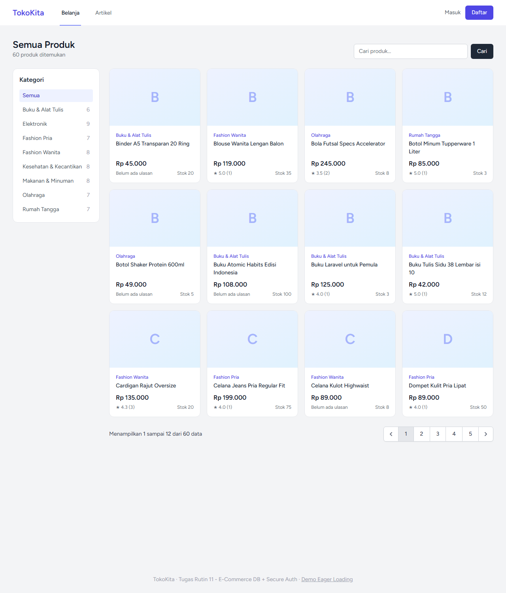
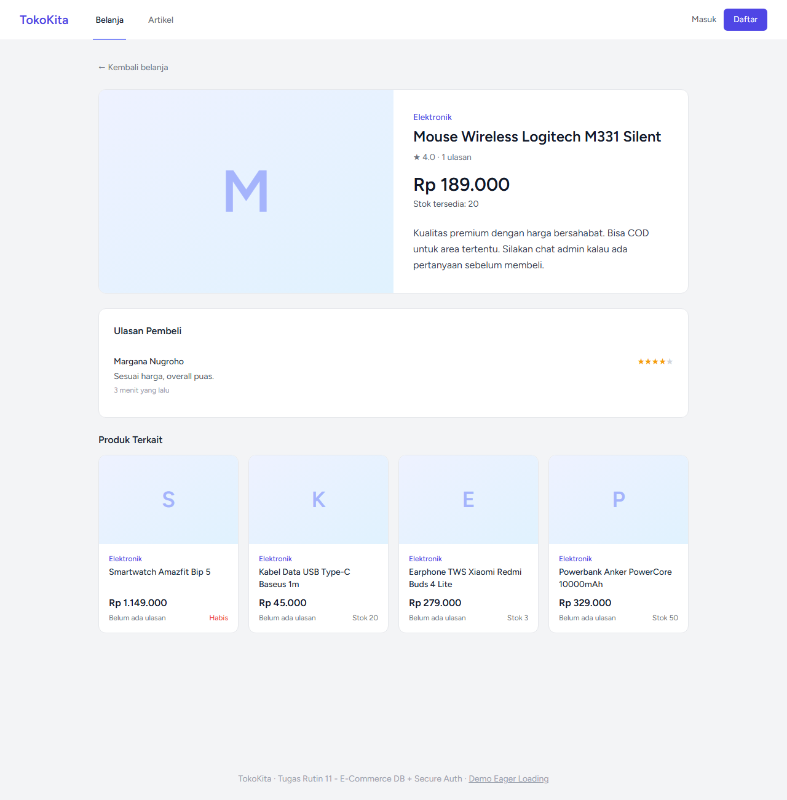
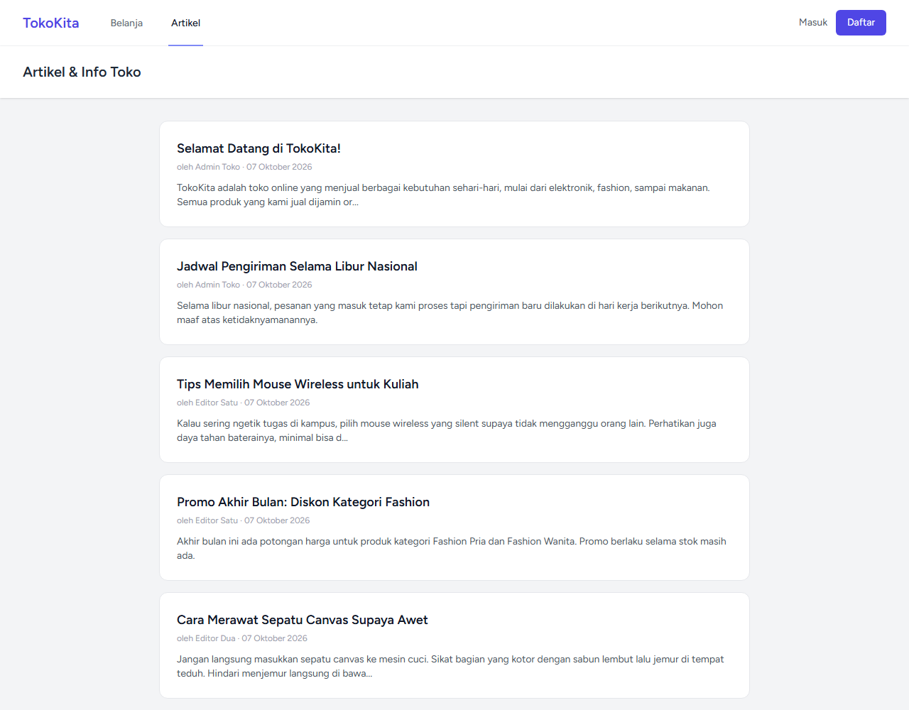
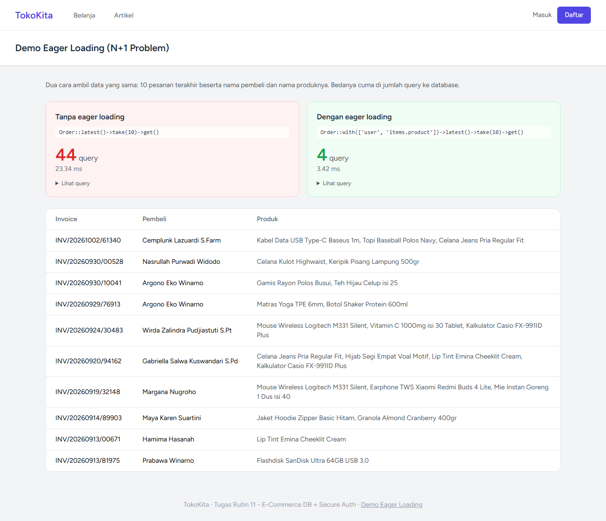
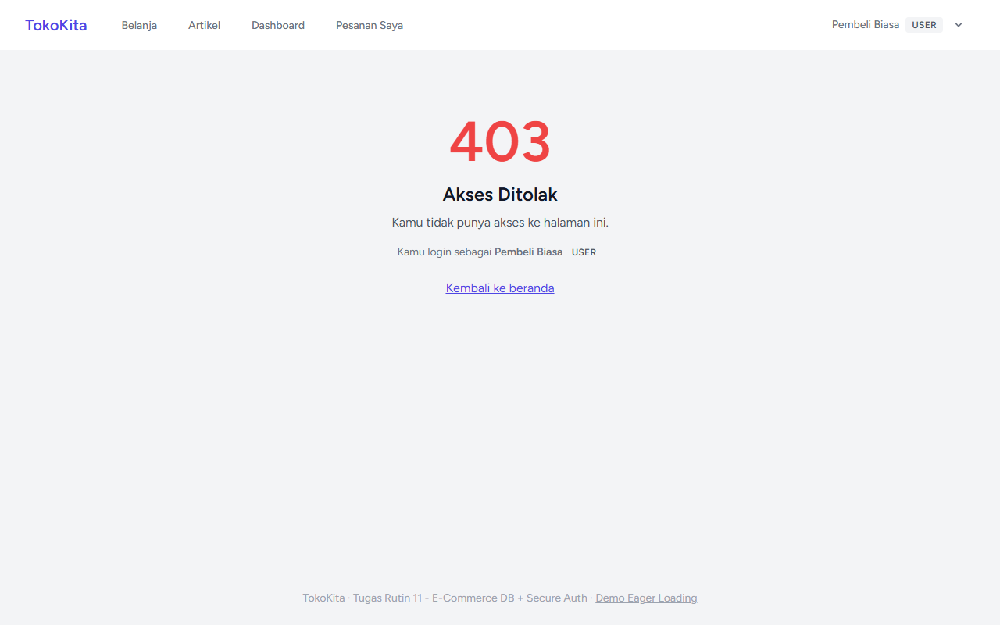
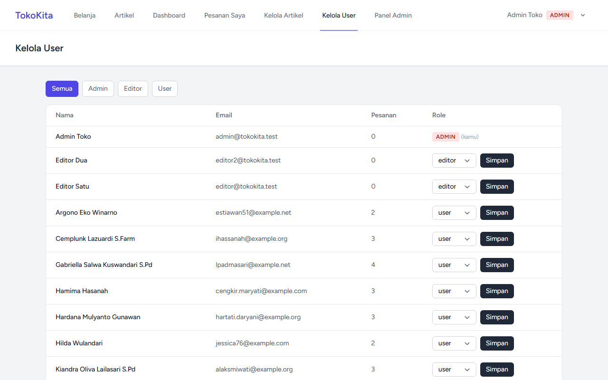

# TugasWeb-P11-EcommerceAuth

Tugas Rutin 11 - E-Commerce DB + Secure Auth. Toko online sederhana **TokoKita** dengan database e-commerce (7 tabel), login pakai Breeze, 3 role (admin / editor / user), custom middleware, dan PostPolicy.

- Laravel 12 + Breeze (Blade)
- PHP 8.2 + MySQL (XAMPP)
- Filament 3 (panel admin)

## Akun Testing

Password semua akun: **`password`**

| Role | Email |
|---|---|
| Admin | `admin@tokokita.test` |
| Editor | `editor@tokokita.test` |
| Editor | `editor2@tokokita.test` |
| User | `user@tokokita.test` |

## Screenshot

| Halaman Toko | Detail Produk |
|---|---|
|  |  |

| Artikel | Demo Eager Loading |
|---|---|
|  |  |

---

## Bagian A - Database & Eloquent

### 1. Migrations 7 tabel + FK

| Tabel | Foreign Key |
|---|---|
| `categories` | - |
| `products` | `category_id` → categories (restrict on delete) |
| `addresses` | `user_id` → users (cascade) |
| `orders` | `user_id` → users (cascade), `address_id` → addresses (set null) |
| `order_items` | `order_id` → orders (cascade), `product_id` → products (restrict) |
| `reviews` | `user_id` → users (cascade), `product_id` → products (cascade) |
| `posts` | `user_id` → users (cascade) |

Ditambah kolom `role` (enum `admin`, `editor`, `user`) di tabel `users`.

```
users ──< addresses
  │  └──< orders >── addresses
  │         └──< order_items >── products >── categories
  ├──< reviews >── products
  └──< posts
```

### 2. Seeders + Factories

- **63 produk** di 8 kategori, nama & harga ditulis manual biar realistis (`CatalogSeeder`)
- 19 user (1 admin, 2 editor, 16 user) + alamat
- ±45 pesanan dengan 1-4 item per pesanan, total dihitung dari item
- Ulasan dari pesanan yang statusnya `completed`
- 6 artikel (1 draft)

Factory: `UserFactory` (state `admin()` & `editor()`), `CategoryFactory`, `ProductFactory`, `AddressFactory`, `OrderFactory`, `OrderItemFactory`, `ReviewFactory`, `PostFactory`.

### 3. Model + Relationships + Scope

| Model | Relasi |
|---|---|
| User | hasMany orders, addresses, reviews, posts |
| Category | hasMany products |
| Product | belongsTo category, hasMany reviews & orderItems, belongsToMany orders |
| Order | belongsTo user & address, hasMany items, belongsToMany products |
| OrderItem | belongsTo order & product |
| Review | belongsTo user & product |
| Post | belongsTo user |

Scope: `Product::active()`, `inStock()`, `priceBetween($min, $max)`, `search($keyword)`, `Order::status($status)`, `Post::published()`.

### 4. Dokumentasi 5 Query Tinker

Lihat [docs/TINKER.md](docs/TINKER.md).

---

## Bagian B - Auth & Security

### 5. Breeze

Login, register, logout, dan profile dari Laravel Breeze (Blade).

### 6. Multi-role + Custom Middleware

`app/Http/Middleware/RoleMiddleware.php`, didaftarkan dengan alias `role` di `bootstrap/app.php`.

```php
Route::middleware(['auth', 'role:admin,editor'])->group(...); // kelola artikel
Route::middleware(['auth', 'role:admin'])->group(...);        // kelola user
```

Kolom `role` sengaja **tidak** dimasukkan ke `$fillable`, jadi orang tidak bisa daftar langsung jadi admin dengan menyisipkan `role=admin` di form register.

### 7. PostPolicy

`app/Policies/PostPolicy.php`

| Aksi | Admin | Editor | User |
|---|---|---|---|
| Lihat artikel publish | ✔ | ✔ | ✔ |
| Lihat draft | ✔ | hanya miliknya | ✘ |
| Tulis artikel | ✔ | ✔ | ✘ |
| Edit / hapus artikel sendiri | ✔ | ✔ | ✘ |
| Edit / hapus artikel orang lain | ✔ | ✘ | ✘ |

Dicek di controller pakai `Gate::authorize()` dan di view pakai `@can` / `@cannot`.

### 8. Route Protection

| Halaman | Tamu | User | Editor | Admin |
|---|---|---|---|---|
| `/`, `/produk/{slug}`, `/artikel` | ✔ | ✔ | ✔ | ✔ |
| `/dashboard`, `/pesanan-saya` | → login | ✔ | ✔ | ✔ |
| `/kelola/posts` | → login | 403 | ✔ | ✔ |
| `/kelola/users` | → login | 403 | 403 | ✔ |
| `/admin` (Filament) | → login | 403 | 403 | ✔ |

Testing incognito 2 role:

| Login sebagai User | Login sebagai Admin |
|---|---|
|  |  |

---

## Bonus

- **Filament admin panel** di `/admin` (khusus admin, lewat `canAccessPanel()` di model User). Ada resource Kategori, Produk, dan Pesanan.
- **Demo eager loading** di `/eager-loading`: data yang sama diambil dua cara. Tanpa eager loading butuh **44 query**, dengan `with(['user', 'items.product'])` cuma **4 query**.

---

## Cara Install

```bash
git clone https://github.com/graceyla/TugasWeb-P11-EcommerceAuth.git
cd TugasWeb-P11-EcommerceAuth

composer install
npm install
npm run build

copy .env.example .env
php artisan key:generate
```

Buat database `db_tr11_ecommerce` di phpMyAdmin, lalu:

```bash
php artisan migrate --seed
php artisan serve
```

Buka `http://127.0.0.1:8000`.

> Filament butuh ekstensi PHP `intl`. Di XAMPP aktifkan dengan menghapus tanda `;` di baris `;extension=intl` pada `php.ini`.

## Struktur Folder Penting

```
app/
├── Filament/Resources/          -> Category, Product, Order (bonus)
├── Http/
│   ├── Controllers/
│   │   ├── ShopController.php
│   │   ├── PostController.php           -> artikel publik
│   │   ├── OrderController.php          -> pesanan saya
│   │   ├── DashboardController.php
│   │   ├── EagerLoadingController.php   -> bonus
│   │   └── Kelola/
│   │       ├── PostController.php       -> CRUD artikel (admin, editor)
│   │       └── UserController.php       -> ubah role (admin)
│   ├── Middleware/RoleMiddleware.php
│   └── Requests/PostRequest.php
├── Models/                      -> User, Category, Product, Address, Order, OrderItem, Review, Post
└── Policies/PostPolicy.php
database/
├── factories/
├── migrations/
└── seeders/                     -> UserSeeder, CatalogSeeder, OrderSeeder, PostSeeder
docs/TINKER.md
routes/web.php
```
