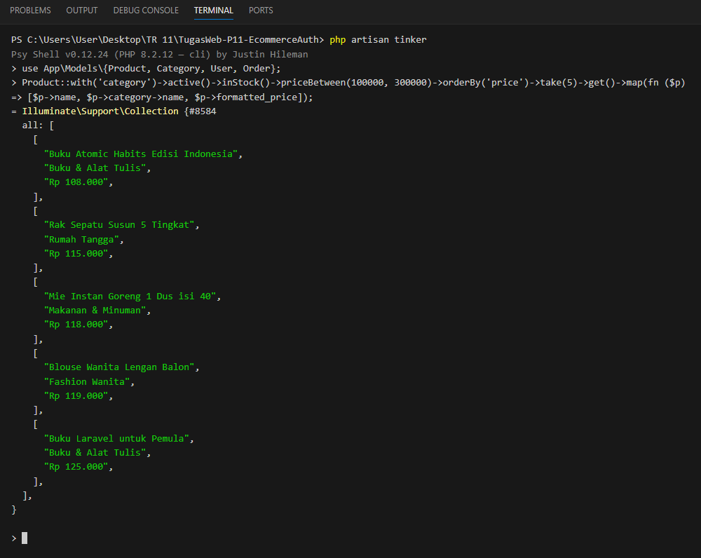
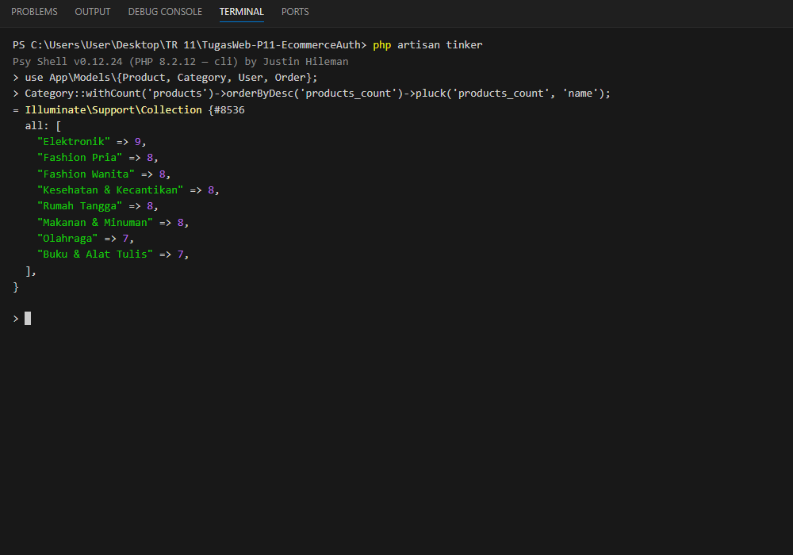
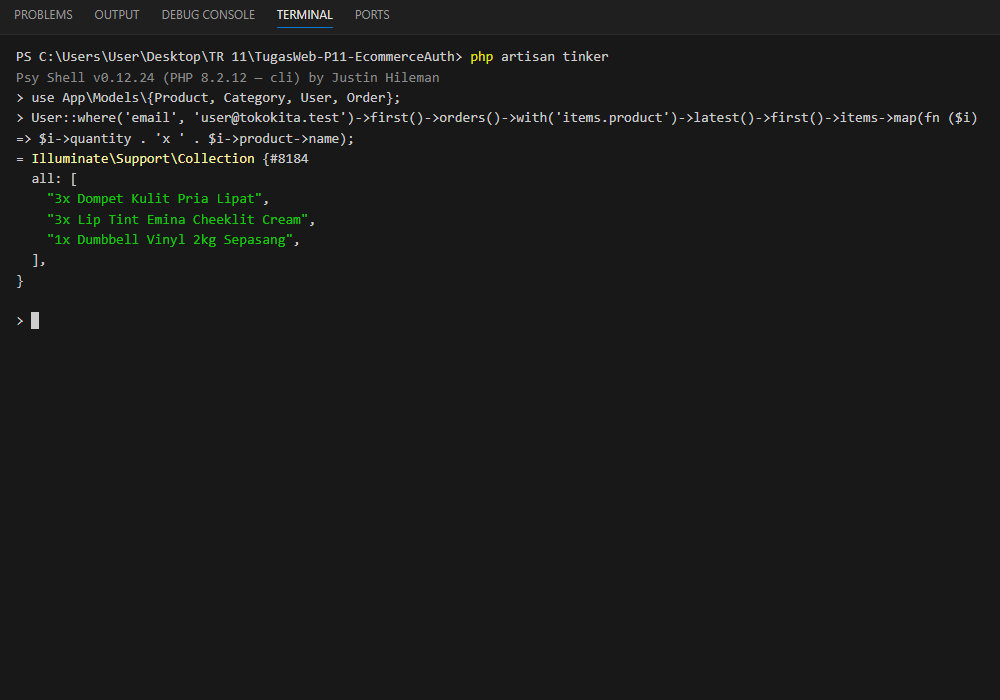
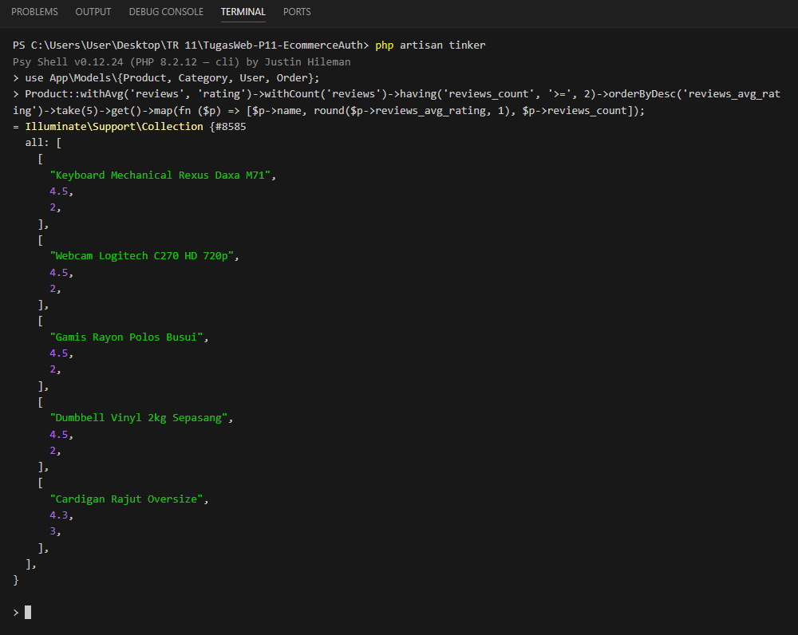
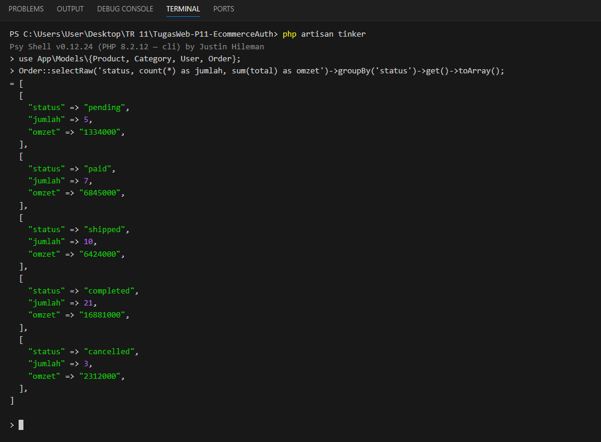

# Dokumentasi 5 Query Tinker

Buka tinker:

```bash
php artisan tinker
```

Import model dulu supaya ga perlu nulis namespace panjang:

```php
use App\Models\{Product, Category, User, Order};
```

---

## 1. Produk aktif, stok ada, harga 100rb - 300rb (pakai 3 scope + eager loading)

```php
Product::with('category')->active()->inStock()->priceBetween(100000, 300000)->orderBy('price')->take(5)->get()->map(fn ($p) => [$p->name, $p->category->name, $p->formatted_price]);
```

Pakai scope `active()`, `inStock()`, `priceBetween()` yang ada di model `Product`, dan relasi `category` di-eager load.



---

## 2. Jumlah produk per kategori

```php
Category::withCount('products')->orderByDesc('products_count')->pluck('products_count', 'name');
```

`withCount` menghitung relasi `hasMany` tanpa perlu ambil semua data produknya.



---

## 3. Isi pesanan terakhir milik user tertentu (relasi bertingkat)

```php
User::where('email', 'user@tokokita.test')->first()->orders()->with('items.product')->latest()->first()->items->map(fn ($i) => $i->quantity . 'x ' . $i->product->name);
```

Relasi: `User` → `orders` → `items` → `product`.



---

## 4. Produk dengan rating rata-rata tertinggi (minimal 2 ulasan)

```php
Product::withAvg('reviews', 'rating')->withCount('reviews')->having('reviews_count', '>=', 2)->orderByDesc('reviews_avg_rating')->take(5)->get()->map(fn ($p) => [$p->name, round($p->reviews_avg_rating, 1), $p->reviews_count]);
```



---

## 5. Rekap jumlah pesanan dan omzet per status

```php
Order::selectRaw('status, count(*) as jumlah, sum(total) as omzet')->groupBy('status')->get()->toArray();
```


